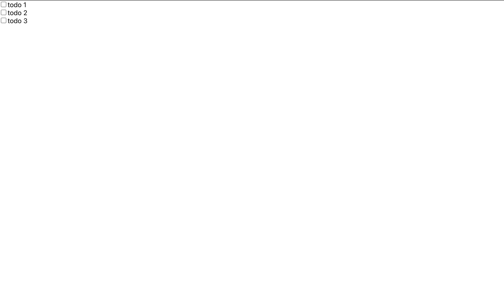

# projektowanie-serwisow-www-jw-185

## laboratorium szóste

## Autor Jeremi Wielewski

### wykonanie zadań ćwiczeniowych

prosta aplikacja w reactcie.
Stan jest przekazywany do dwóch komponentów TodoList oraz TodoListItem.

_wykonanie zadań_
