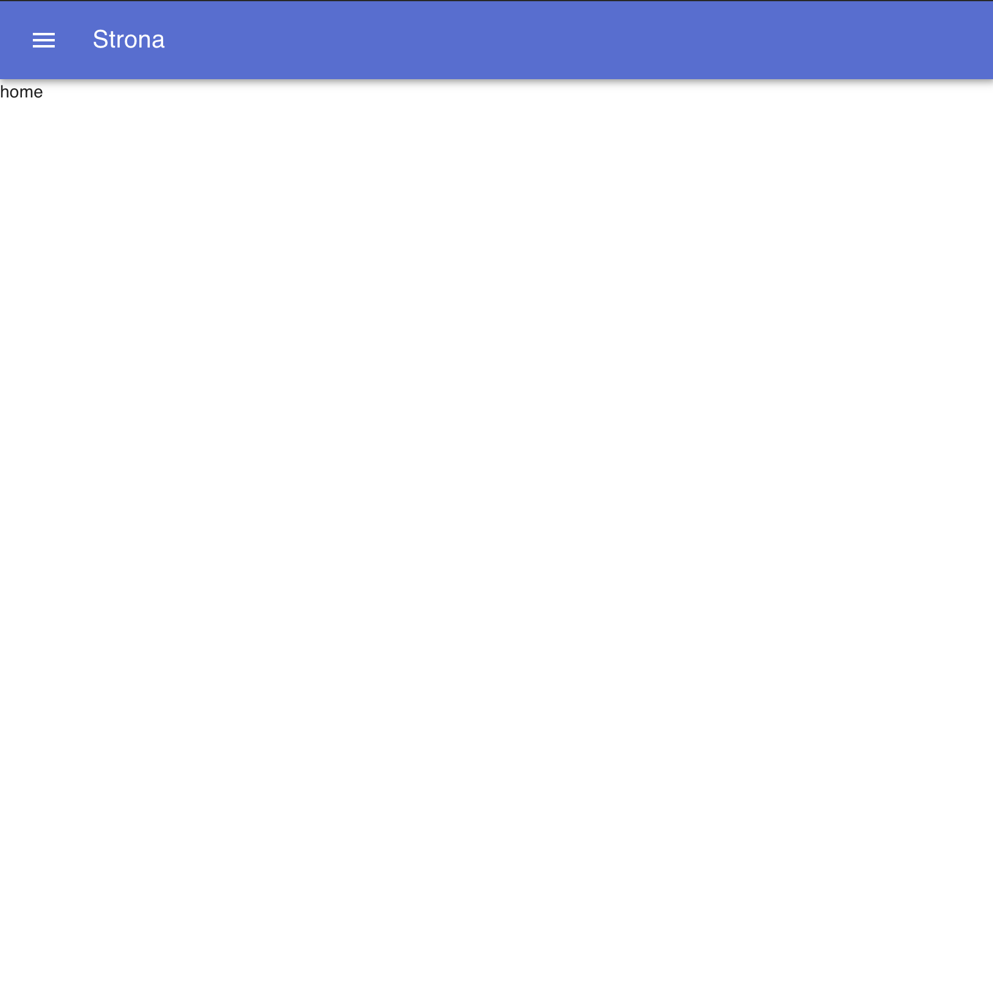
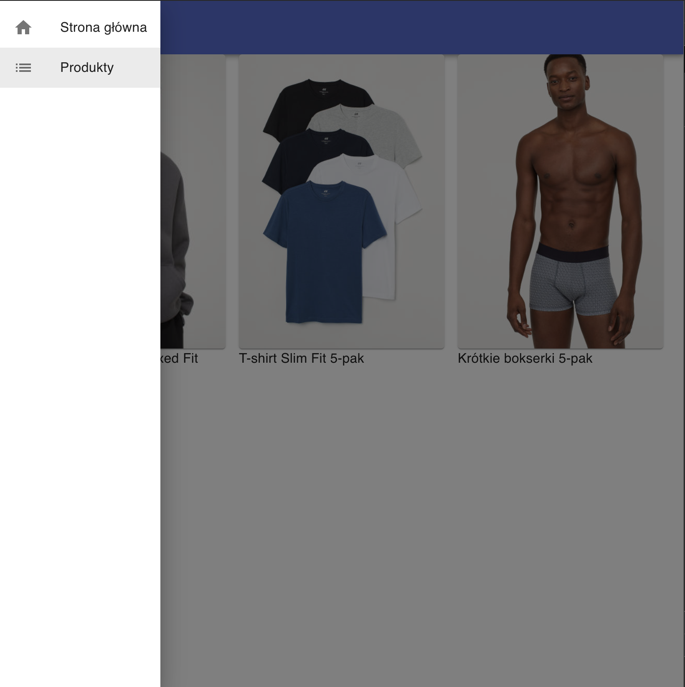
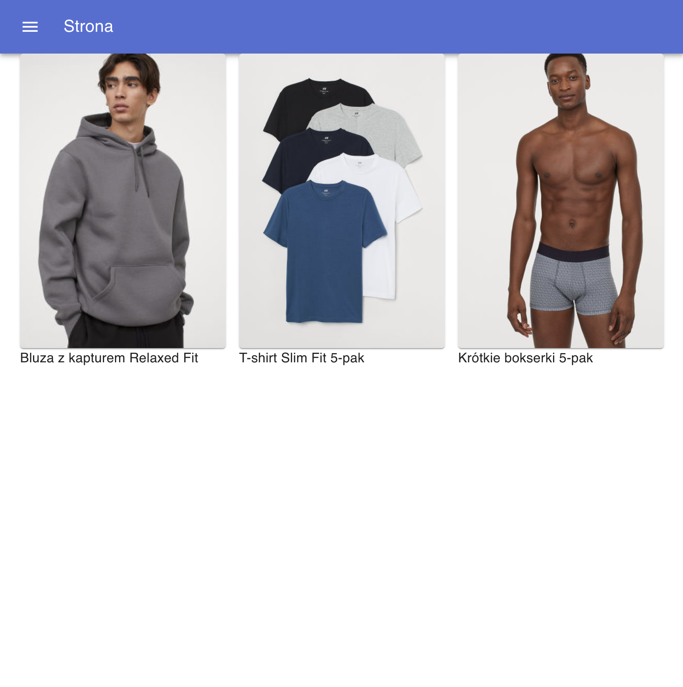
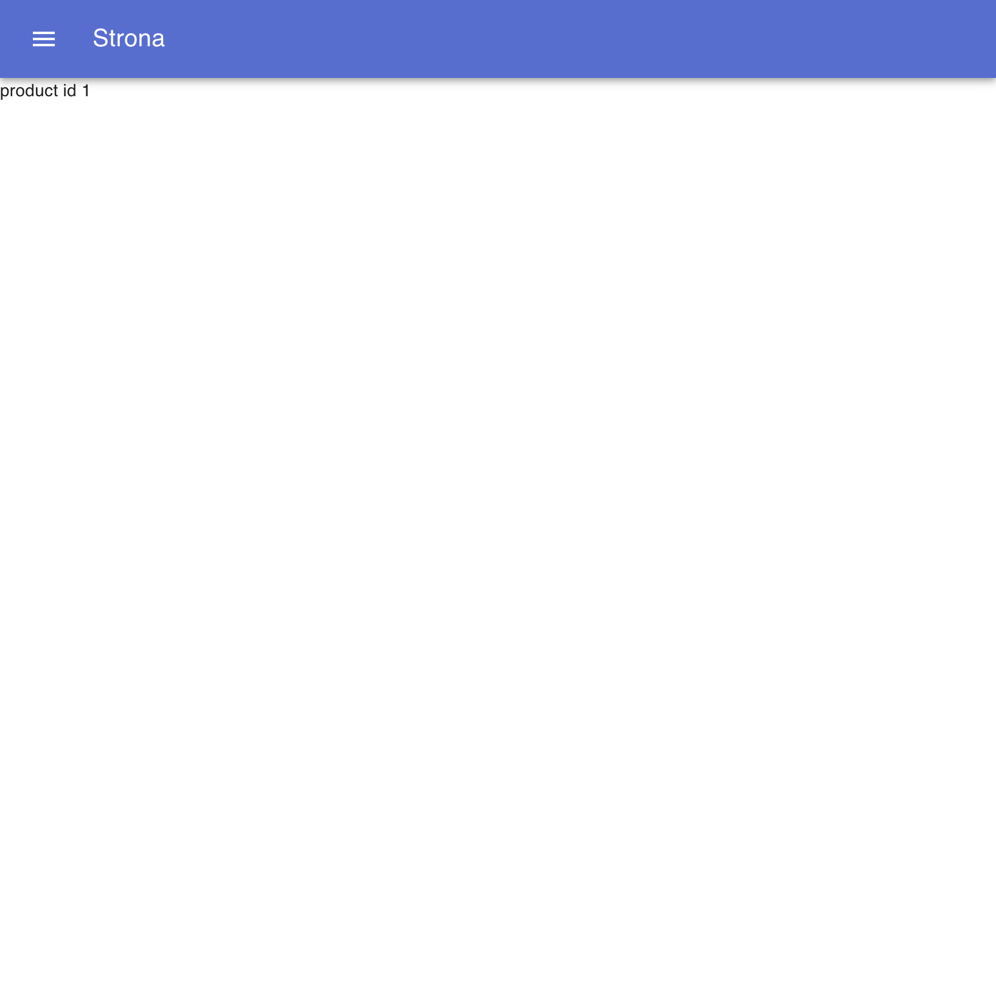

# projektowanie-serwisow-www-jw-185

## Jeremi Wielewski

## laboratorium siódme

Projekt strony napisanej w reactcie, wykorzystującej biblioteki material ui, oraz react router

Dostępne ścieżki:

-   / - strona domowa
-   /products - katalog produktów
-   /products/:id - strona szczegółów produktu

### Strona glówna

### Nawigacja

Nawigacja na stronie odbywa się za pomocą drawera. Na liście dostępnych ścieżek, podświetla się ta, która została wybrana.

### katalog produktów

Prosty katalog produktów z wykorzystaniem komponentów Grid oraz Paper. Zdjęcia stanowią odnośniki do strony szczegółów produktu.

### szczegóły produktu

Nie dodałem obsługi stanu globalnego, dlatego wyświetlane jest jedynie id produktu przekazanego w parametrach url.

