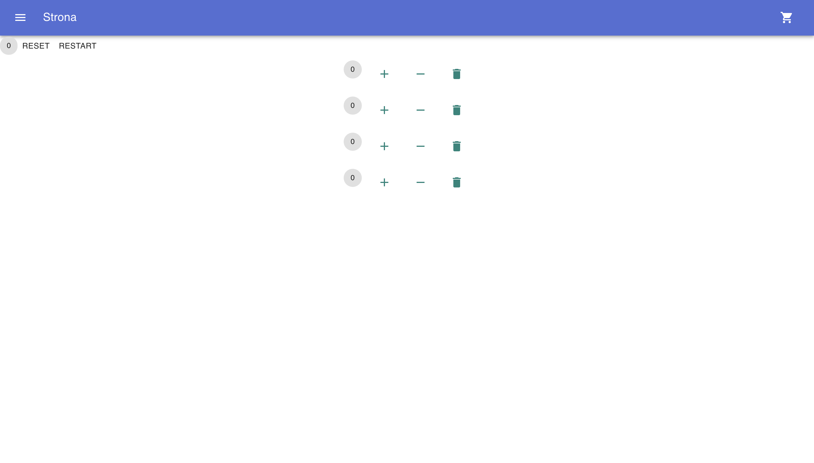
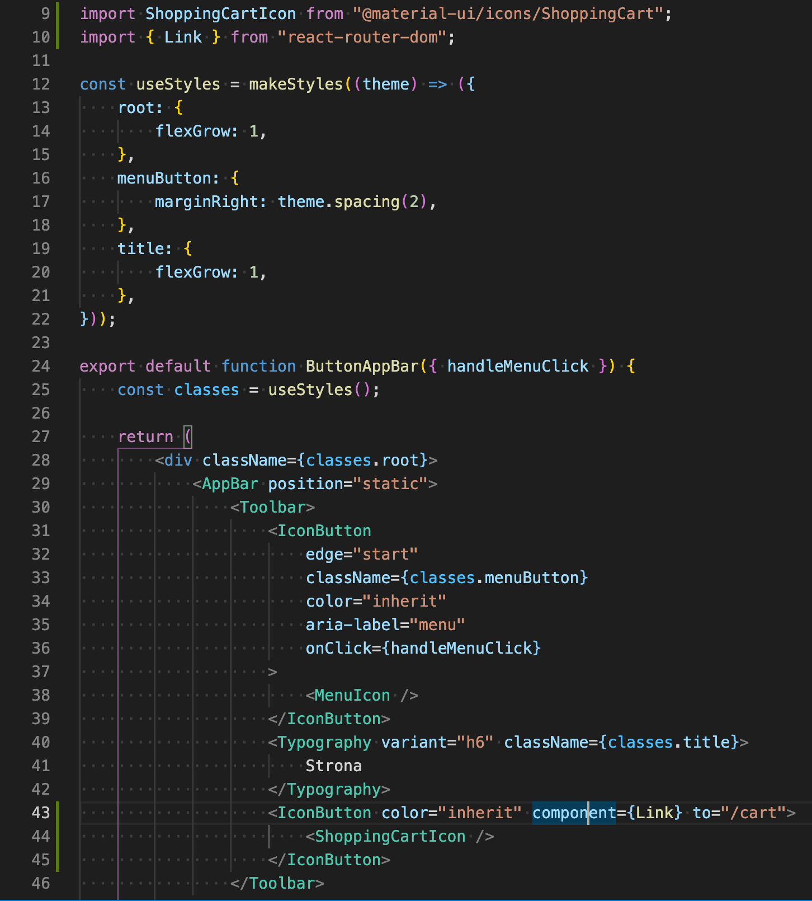
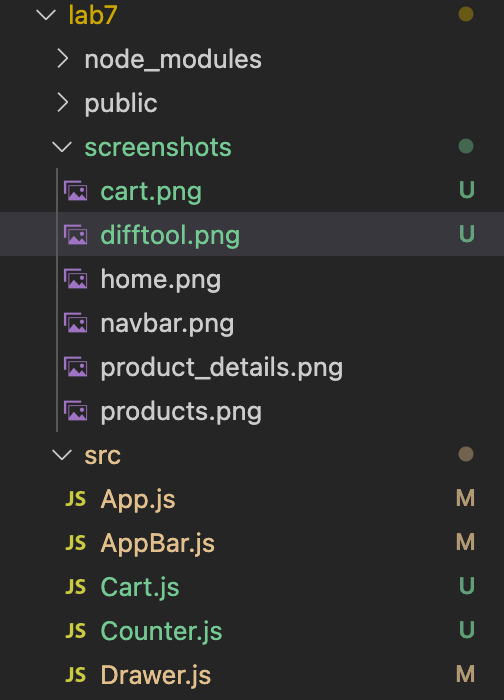

# projektowanie-serwisow-www-jw-185

## Jeremi Wielewski

## laboratorium ósme

### laboratorium ósme

w tym laboratorium dodałem implemenetację prostego koszyka w reactcie. Wykorzystałem object assign oraz spread operator. Przykład na ktorym się wzorowałem https://github.com/arnab-datta/counter-app.

Korzystam z rozszerzenia git do visual studio code które pozwala mi osiągnąć podobne efekety co git difftool

Powyższy przykład pokazuje różnicę pomiędzy ostatnim commitem wprowadzone w pojedynczym pliku.

tutaj możemy zobaczyć jak zmieniła się struktura całego katalogu.

## laboratorium siódme

Projekt strony napisanej w reactcie, wykorzystującej biblioteki material ui, oraz react router

Dostępne ścieżki:

-   / - strona domowa
-   /products - katalog produktów
-   /products/:id - strona szczegółów produktu

### Strona glówna

### Nawigacja

Nawigacja na stronie odbywa się za pomocą drawera. Na liście dostępnych ścieżek, podświetla się ta, która została wybrana.

### katalog produktów

Prosty katalog produktów z wykorzystaniem komponentów Grid oraz Paper. Zdjęcia stanowią odnośniki do strony szczegółów produktu.

### szczegóły produktu

Nie dodałem obsługi stanu globalnego, dlatego wyświetlane jest jedynie id produktu przekazanego w parametrach url.

